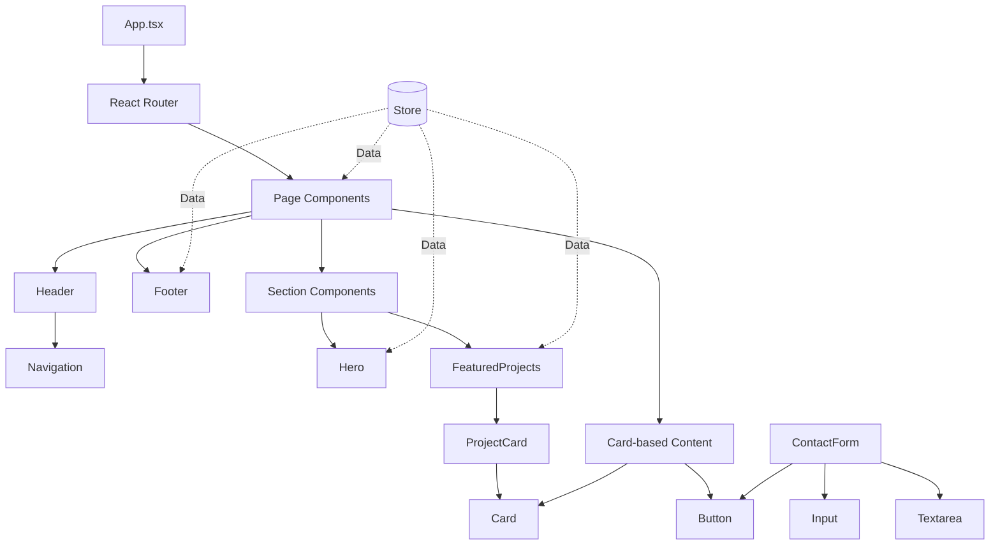

# Components Guide

This document provides a comprehensive map of all components in the Animation Studio website, their relationships, dependencies, and usage patterns.

## Component Hierarchy

```
App
├── Router
    ├── Home Page
    │   ├── Header
    │   │   └── Navigation
    │   ├── Hero
    │   │   └── Button (2x)
    │   ├── FeaturedProjects
    │   │   ├── ProjectCard (3x)
    │   │   │   └── Card
    │   │   └── Button (1x)
    │   └── Footer
    │
    ├── Portfolio Page
    │   ├── Header
    │   │   └── Navigation
    │   ├── Button (7x - filter buttons)
    │   ├── ProjectCard (6x)
    │   │   └── Card
    │   └── Footer
    │
    ├── About Page
    │   ├── Header
    │   │   └── Navigation
    │   ├── Card (4x - team member cards)
    │   └── Footer
    │
    ├── Services Page
    │   ├── Header
    │   │   └── Navigation
    │   ├── Card (6x - service cards)
    │   ├── Button (2x - CTA buttons)
    │   └── Footer
    │
    └── Contact Page
        ├── Header
        │   └── Navigation
        ├── ContactForm
        │   ├── Input (3x)
        │   ├── Textarea (1x)
        │   └── Button (1x)
        ├── Card (3x - contact info cards)
        └── Footer
```

## Component Categories

### Layout Components (`src/components/layout/`)

#### Header
- **Purpose**: Main navigation bar with logo
- **Used in**: All pages (5 times)
- **Dependencies**: Navigation
- **Data**: None (presentational)
- **File**: `Header.tsx`
- **Doc**: `Header.md`

#### Navigation
- **Purpose**: Responsive navigation menu
- **Used in**: Header (1 time)
- **Dependencies**: React Router (Link, useLocation)
- **Data**: Static nav links array
- **File**: `Navigation.tsx`
- **Doc**: `Navigation.md`

#### Footer
- **Purpose**: Site footer with contact info and links
- **Used in**: All pages (5 times)
- **Dependencies**: React Router (Link), useStore
- **Data**: Contact info from store
- **File**: `Footer.tsx`
- **Doc**: `Footer.md`

### UI Components (`src/components/ui/`)

#### Button
- **Purpose**: Reusable button with variants
- **Used in**: Multiple pages (15+ times)
- **Dependencies**: None
- **Data**: Props (variant, size, children, etc.)
- **File**: `Button.tsx`
- **Doc**: `Button.md`
- **Variants**: primary, secondary, outline, ghost
- **Sizes**: sm, md, lg

#### Card
- **Purpose**: Container component for content blocks
- **Used in**: Multiple pages (20+ times)
- **Dependencies**: None
- **Data**: Props (children, hoverable, padding)
- **File**: `Card.tsx`
- **Doc**: `Card.md`

#### Input
- **Purpose**: Text input field with validation
- **Used in**: Contact form (3 times)
- **Dependencies**: forwardRef for form libraries
- **Data**: Props (label, error, value, etc.)
- **File**: `Input.tsx`
- **Doc**: `Input.md`

#### Textarea
- **Purpose**: Multi-line text input
- **Used in**: Contact form (1 time)
- **Dependencies**: forwardRef for form libraries
- **Data**: Props (label, error, value, rows, etc.)
- **File**: `Textarea.tsx`
- **Doc**: `Textarea.md`

#### ContactForm
- **Purpose**: Complete contact form with validation
- **Used in**: Contact page (1 time)
- **Dependencies**: Input, Textarea, Button
- **Data**: Local state (formData, errors)
- **File**: `ContactForm.tsx`
- **Doc**: `ContactForm.md`

#### ProjectCard
- **Purpose**: Display project information in a card
- **Used in**: Home, Portfolio pages (9+ times)
- **Dependencies**: Card, Project type
- **Data**: Project object from props
- **File**: `ProjectCard.tsx`
- **Doc**: `ProjectCard.md`

### Section Components (`src/components/sections/`)

#### Hero
- **Purpose**: Landing section with CTA
- **Used in**: Home page (1 time)
- **Dependencies**: Button, useStore
- **Data**: Studio info from store
- **File**: `Hero.tsx`
- **Doc**: `Hero.md`

#### FeaturedProjects
- **Purpose**: Showcase featured portfolio items
- **Used in**: Home page (1 time)
- **Dependencies**: ProjectCard, Button, useStore
- **Data**: Featured projects from store
- **File**: `FeaturedProjects.tsx`
- **Doc**: `FeaturedProjects.md`

### Page Components (`src/pages/`)

#### Home
- **Purpose**: Landing page
- **Components**: Header, Hero, FeaturedProjects, Footer
- **File**: `Home.tsx`

#### Portfolio
- **Purpose**: Project gallery with filters
- **Components**: Header, Button (filters), ProjectCard, Footer
- **File**: `Portfolio.tsx`

#### About
- **Purpose**: Studio and team information
- **Components**: Header, Card (team), Footer
- **File**: `About.tsx`

#### Services
- **Purpose**: Services showcase
- **Components**: Header, Card (services), Button, Footer
- **File**: `Services.tsx`

#### Contact
- **Purpose**: Contact information and form
- **Components**: Header, ContactForm, Card (info), Footer
- **File**: `Contact.tsx`

## Data Flow

### Store (`src/store/store.ts`)
Central state management using Zustand:

```typescript
Store
├── projects: Project[]
├── teamMembers: TeamMember[]
├── services: Service[]
├── contactInfo: ContactInfo
├── studioInfo: StudioInfo
└── Actions:
    ├── fetchProjects()
    ├── fetchTeamMembers()
    ├── fetchServices()
    ├── fetchContactInfo()
    ├── fetchStudioInfo()
    ├── filterProjectsByCategory()
    └── getFeaturedProjects()
```

### Components Using Store

| Component | Store Data Used | Store Actions Used |
|-----------|----------------|-------------------|
| Hero | studioInfo | - |
| FeaturedProjects | - | getFeaturedProjects() |
| Portfolio | projects | - |
| About | studioInfo, teamMembers | - |
| Services | services | - |
| Contact | contactInfo | - |
| Footer | contactInfo | - |
| ProjectCard | - (via props) | - |

## Component Communication Patterns

### Props Down Pattern
- Parent components pass data to children via props
- Example: `ProjectCard` receives `project` object from parent

### Store Pattern
- Components access global state via `useStore` hook
- No prop drilling for global data like projects, team members, etc.

### Event Up Pattern
- Child components emit events via callback props
- Example: `Button` onClick handlers

## Reusable Components

### Highly Reusable
- **Button**: Used 15+ times across all pages
- **Card**: Used 20+ times for various content types
- **ProjectCard**: Used 9+ times for project displays

### Moderately Reusable
- **Input**: Used 3 times in contact form
- **Textarea**: Used 1 time but designed for reuse

### Single-Use Components
- **Header**: Used on all pages but single instance
- **Footer**: Used on all pages but single instance
- **Hero**: Home page only
- **FeaturedProjects**: Home page only
- **ContactForm**: Contact page only

## Component Dependencies Graph



## Component Size Report

All components comply with the <300 lines rule:

| Component | Lines | Status |
|-----------|-------|--------|
| Header | ~80 | ✅ |
| Navigation | ~70 | ✅ |
| Footer | ~140 | ✅ |
| Button | ~60 | ✅ |
| Card | ~40 | ✅ |
| Input | ~60 | ✅ |
| Textarea | ~60 | ✅ |
| ContactForm | ~140 | ✅ |
| ProjectCard | ~90 | ✅ |
| Hero | ~100 | ✅ |
| FeaturedProjects | ~60 | ✅ |
| Home | ~20 | ✅ |
| Portfolio | ~80 | ✅ |
| About | ~170 | ✅ |
| Services | ~120 | ✅ |
| Contact | ~190 | ✅ |

## Best Practices Observed

1. **Single Responsibility**: Each component has one clear purpose
2. **Dumb Components**: UI components are presentational, not stateful
3. **Composition**: Complex UIs built from small, reusable pieces
4. **Documentation**: Every component has a corresponding .md file
5. **TypeScript**: Full type safety with interfaces
6. **Consistent Styling**: Tailwind CSS utilities used throughout
7. **Accessibility**: ARIA labels, semantic HTML, keyboard navigation

## Future Expansion Areas

### Phase 2 - Edit Mode
- **EditableText**: In-place text editing
- **ImageUploader**: Drag-and-drop image upload
- **MediaManager**: Browse and select media
- **AdminPanel**: Content management interface

### Additional Features
- **Modal**: Popup dialogs for project details
- **Carousel**: Image/project slider
- **VideoPlayer**: Custom video player with controls
- **LoadingSpinner**: Loading state indicator
- **Toast**: Notification messages
- **Dropdown**: Dropdown menus

## Maintenance Notes

### Adding a New Component

1. Create component file in appropriate directory
2. Create corresponding .md documentation
3. Update this guide with:
   - Component hierarchy
   - Usage count
   - Dependencies
   - Data flow
4. Ensure component is under 300 lines
5. Add TypeScript types to `src/types/index.ts` if needed

### Modifying Existing Components

1. Update component code
2. Update corresponding .md file
3. Update usage count in documentation
4. Update this guide if relationships changed
5. Test in all locations where component is used

### Deprecating Components

1. Document in `cleanUp.md`
2. Remove from this guide
3. Update dependent components
4. Remove component files

## Component Testing Checklist

- [ ] Component renders without errors
- [ ] Props are properly typed
- [ ] Responsive on mobile/tablet/desktop
- [ ] Accessibility attributes present
- [ ] Works with keyboard navigation
- [ ] Matches design system
- [ ] No console warnings
- [ ] Documentation is accurate and complete

